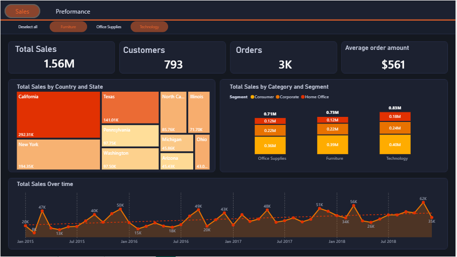
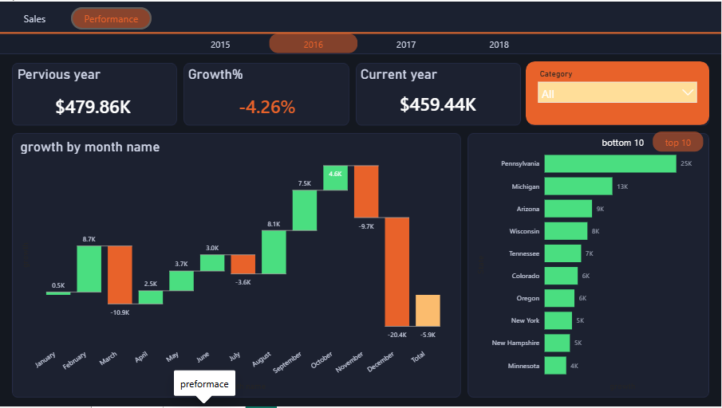
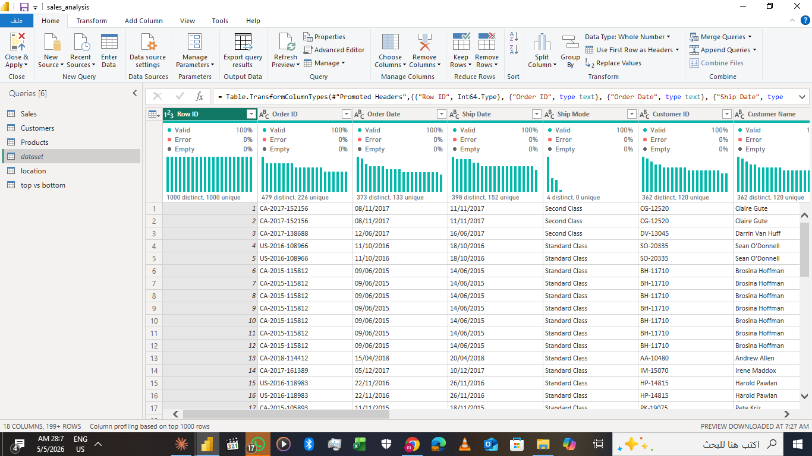
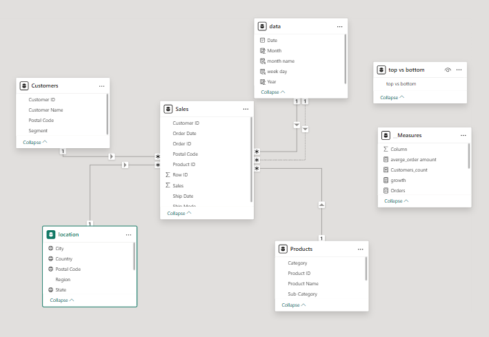

# Sales Analysis — Power BI Dashboard

A full-cycle **Power BI sales analytics project** covering data gathering, normalization, cleaning, data modeling, DAX calculations, and interactive visualization across two report pages: **Overview** and **Performance**.

---


### Overview Page



### Performance Page



---

## 🎬 Demo Video


---

## Table of Contents

1. [Project Overview](#project-overview)
2. [Data Architecture — Normalization](#data-architecture--normalization)
3. [Data Model](#data-model)
4. [Data Preparation — Power Query](#data-preparation--power-query)
5. [DAX Measures](#dax-measures)
6. [Dashboard Pages](#dashboard-pages)
7. [Interactivity & Filters](#interactivity--filters)
8. [File Structure](#file-structure)
9. [How to Use](#how-to-use)
10. [Tools & Technologies](#tools--technologies)

---

## Project Overview

This project analyzes sales performance data to answer key business questions:

- What are the total sales, order volume, and customer count?
- Which product categories and customer segments drive the most revenue?
- Which states/regions generate the most sales?
- How does current-year sales compare to the previous year?
- Where is growth accelerating or declining month by month?

The raw data arrived as a **single large CSV file**. To improve performance and reduce redundancy, it was normalized into multiple tables before being loaded into Power BI's data model.

---

## Data Architecture — Normalization

### The Problem with One Big CSV
A flat CSV containing every transaction alongside customer details, product info, and location data creates massive redundancy — customer names, product categories, and state names repeat on every single row. This inflates file size, slows refresh times, and makes relationships harder to manage.


### The Solution — Star Schema
The flat file was split into **dimension tables** and a **fact table**:

| Table | Type | Description |
|---|---|---|
| `Sales` | Fact | Core sales transactions — order ID, date, amounts, quantities |
| `Customers` | Dimension | Customer ID, name, segment |
| `Products` | Dimension | Product ID, category, sub-category hierarchy |
| `location` | Dimension | State, country/region hierarchy |
| `top vs bottom` | Helper | Slicer table for top/bottom N filtering |
| `Date` | Dimension | Date, year, month, month name, week day |

### Benefits of Normalization
- Each customer, product, and location is stored **once** — no repeated text values
- Smaller model size → faster refresh and query performance
- Cleaner DAX — measures reference dimension tables via relationships rather than scanning flat columns
- Easy to extend — add new products or locations without touching the fact table

---

## Data Model

The tables are connected in a **star schema** with the `data` fact table at the center:



Relationships are all **one-to-many** from dimension tables into the fact table, with **single-direction cross-filtering** to keep DAX measures predictable.

---

## Data Preparation — Power Query

All cleaning and transformation was done in Power Query (M language) before loading into the data model.

### Step 1 — Load the Source CSV
```m
let
    Source = Csv.Document(
        File.Contents("C:\data\sales_raw.csv"),
        [Delimiter=",", Encoding=65001, QuoteStyle=QuoteStyle.None]
    ),
    PromotedHeaders = Table.PromoteHeaders(Source, [PromoteAllScalars=true])
in
    PromotedHeaders
```

### Step 2 — Clean & Type the Fact Table
```m
let
    // Remove nulls in key columns
    Filtered = Table.SelectRows(PromotedHeaders,
        each [Order ID] <> null and [Sales] <> null),

    // Correct data types
    Typed = Table.TransformColumnTypes(Filtered, {
        {"Order Date",  type date},
        {"Ship Date",   type date},
        {"Sales",       type number},
        {"Quantity",    type number},
        {"Discount",    type number},
        {"Profit",      type number}
    }),

    // Add Year and Month columns for time intelligence
    AddedYear      = Table.AddColumn(Typed, "Year",
                         each Date.Year([Order Date]), Int64.Type),
    AddedMonth     = Table.AddColumn(AddedYear, "Month",
                         each Date.Month([Order Date]), Int64.Type),
    AddedMonthName = Table.AddColumn(AddedMonth, "month name",
                         each Date.ToText([Order Date], "MMM"), type text)
in
    AddedMonthName
```

### Step 3 — Split Out Dimension Tables

Each dimension was created as a **reference query** from the cleaned fact table, keeping only the relevant columns and deduplicating:

```m
// Products dimension
let
    Source   = CleanedFact,
    Selected = Table.SelectColumns(Source,
                   {"Product ID","Category","Sub-Category","Product Name"}),
    Distinct = Table.Distinct(Selected, {"Product ID"}),
    Sorted   = Table.Sort(Distinct, {{"Category", Order.Ascending}})
in
    Sorted
```

```m
// Customers dimension
let
    Source   = CleanedFact,
    Selected = Table.SelectColumns(Source,
                   {"Customer ID","Customer Name","Segment"}),
    Distinct = Table.Distinct(Selected, {"Customer ID"})
in
    Distinct
```

```m
// Location dimension
let
    Source   = CleanedFact,
    Selected = Table.SelectColumns(Source, {"State","Country","Region"}),
    Distinct = Table.Distinct(Selected, {"State"})
in
    Distinct
```

### Step 4 — Disable Load on Helper Queries
All staging/intermediate queries were set to **Disable Load** (right-click → uncheck "Enable load") so they don't appear in the data model and don't inflate file size.

---

## DAX Measures

All KPIs and calculations are stored in a dedicated `__Measures` table so they are easy to find and reuse across pages.

### Core Sales Measures

```dax
-- Total revenue across all transactions
Total_Sales =
SUM('Sales'[Sales])
```

```dax
-- Count of unique customers
Customers_count =
DISTINCTCOUNT('Sales'[Customer ID])
```

```dax
-- Count of unique orders
Orders =
DISTINCTCOUNT('Sales'[Order ID])
```

```dax
-- Average revenue per order
averge_order amount =
DIVIDE(
    [Total_Sales],
    [Orders],
    0
)
```

### Time Intelligence Measures

```dax
-- Year-to-date sales (resets on Jan 1 each year)
YTD_Sales =
TOTALYTD(
    [Total_Sales],
    'data'[Order Date]
)
```

```dax
-- Same period in the previous year
PYTD_Sales =
CALCULATE(
    [YTD_Sales],
    SAMEPERIODLASTYEAR('data'[Order Date])
)
```

```dax
-- Absolute growth vs previous year
growth =
[YTD_Sales] - [PYTD_Sales]
```

```dax
-- Revenue growth percentage vs previous year
revenue_growth =
DIVIDE(
    [growth],
    [PYTD_Sales],
    0
)
```

### Dynamic Top / Bottom Filter

```dax
-- Ranks states and filters to top N or bottom N based on slicer selection
Top_Bottom_Sales =
VAR SelectedFilter = SELECTEDVALUE('top vs bottom'[top vs bottom])
VAR TotalStates    = COUNTROWS(ALL(location[State]))
VAR RankValue =
    RANKX(
        ALL(location[State]),
        [Total_Sales],
        ,
        DESC,
        DENSE
    )
RETURN
    IF(
        SelectedFilter = "Top"    && RankValue <= 10,             [Total_Sales],
        IF(
            SelectedFilter = "Bottom" && RankValue > TotalStates - 10, [Total_Sales],
            BLANK()
        )
    )
```

---

## Dashboard Pages

### Page 1 — Overview

High-level snapshot of overall business performance.

**KPI Cards**

| Card Title | Measure |
|---|---|
| Total Sales | `Total_Sales` |
| Customers | `Customers_count` |
| Orders | `Orders` |
| Average Order Amount | `averge_order amount` |

**Visuals**

- **Area Chart — Total Sales Over Time**: Trend by Year → Quarter → Month drill-down. Shows seasonality and long-term growth direction.
- **Column Chart — Total Sales by Category and Segment**: Clustered columns by product Category and Sub-Category, with Customer Segment (Consumer / Corporate / Home Office) as a color series. Reveals which segments drive which categories.
- **Treemap — Total Sales by State**: Geographic revenue proportion — larger tiles = higher revenue states. Built from `location.Country Hierarchy.State`.
- **Slicer — Category**: Filters all Overview visuals by product category.

---

### Page 2 — Performance

Year-over-year comparison page built for growth tracking.

**KPI Cards**

| Card Title | Measure |
|---|---|
| Current Year (YTD) | `YTD_Sales` |
| Previous Year (PYTD) | `PYTD_Sales` |
| Growth % | `revenue_growth` |

**Visuals**

- **Waterfall Chart — Growth by Month**: Month-by-month contribution to total growth. Positive months show as gains (green), negative as losses (red) — seasonal patterns are immediately visible.
- **Clustered Bar Chart — Growth by State**: States ranked by growth. The **Top vs Bottom slicer** dynamically filters to show only the highest-growth or lowest-growth states.
- **Slicer — Year**: Filters all Performance visuals to a selected year.
- **Slicer — Category**: Filters by product category.
- **Slicer — Top vs Bottom**: Toggles the bar chart between top performers and bottom performers.

---

## Interactivity & Filters

- **Cross-filtering**: Clicking any bar, tile, or data point filters all other visuals on the same page simultaneously.
- **Drill-down**: Area chart and column chart support hierarchy drill-down (Year → Quarter → Month; Category → Sub-Category).
- **Navigation buttons**: Action buttons on the Overview page navigate to the Performance page and back.
- **Persistent slicers**: Category and Year selections stay active while exploring other visuals on the same page.
- **Dynamic ranking**: The Top vs Bottom slicer on the Performance page recalculates the state bar chart on every selection without any hard-coded filter.

---

## File Structure

```
sales-analysis-dashboard/
│
├── sales_analysis.pbix           # Main Power BI report file
│
├── README.md                     # This documentation file
│
├── data/
│   └── raw_data.csv             # Original flat source file
│
└── screenshots/
    ├── overview.png               # Overview page screenshot
    ├── performance.png            # Performance page screenshot
    └── video_thumbnail.png        # Demo video thumbnail
```

---

## How to Use

### Open the Report
1. Install **Power BI Desktop** (free from [microsoft.com/power-bi](https://powerbi.microsoft.com/desktop)).
2. Open `sales_analysis.pbix`.
3. The report opens on the **Overview** page.

### Navigate Between Pages
- Use the **page tabs** at the bottom (Overview / Performance), or
- Use the **navigation buttons** on the canvas to jump between pages.

### Apply Filters
- Use the **Category slicer** to focus on Furniture, Office Supplies, or Technology.
- On the Performance page, use the **Year slicer** to analyze a specific year.
- Use the **Top vs Bottom slicer** to toggle between best and worst performing states.
- Click any chart element to **cross-filter** all other visuals on the page.
- Click the same element again to **clear** the filter.

### Refresh Data
1. Replace the source CSV at the original file path, or update the data source connection via **Home → Transform data → Data source settings**.
2. Click **Home → Refresh** (or press `F5`).
3. All visuals, measures, and rankings update automatically.

---

## Tools & Technologies

| Tool | Role |
|---|---|
| Power BI Desktop | Report authoring, visuals, publishing |
| Power Query (M) | Data ingestion, cleaning, normalization |
| DAX | Measures, KPIs, time intelligence, dynamic ranking |
| Star Schema Design | Data model architecture |
| Bookmarks & Buttons | Page navigation |
| Custom Theme (Solar) | Visual styling |

---

## Author

**Mahmoud Okasha**  
GitHub: [github.com/mahmoud-okasha](https://github.com/mahmoud-okasha)
